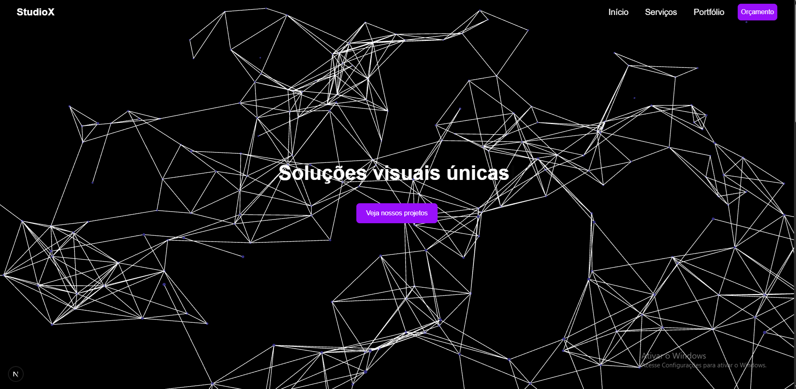

# 🎨 StudioX - Landing Page para Estúdio de Design

 

---

## 📌 Descrição do Projeto

**StudioX** é uma landing page moderna desenvolvida para um estúdio de design que oferece serviços como **Branding de Marca**, **Web Design** e **UI/UX Design**.

O principal objetivo deste projeto foi criar uma interface com forte apelo visual e interativo, utilizando **animações de background com Vanta.js (Three.js)**, além de aplicar **boas práticas de responsividade**, **design moderno** e foco na **experiência do usuário**.

---

## 🛠️ Tecnologias Utilizadas

- Next.js (App Router)
- React.js
- Tailwind CSS
- Vanta.js (Three.js) – para o background animado tipo "Net"
- JavaScript (ES6+)
- Framer Motion (animações de elementos)

---

## 🚀 Funcionalidades

- ✅ Landing Page com foco comercial
- ✅ Seções de serviços: Branding, Web Design e UI/UX
- ✅ Background animado com efeito NET via Vanta.js/Three.js
- ✅ Layout responsivo (Mobile First)
- ✅ Animações suaves com Framer Motion
- ✅ Deploy na Vercel

---

## 📷 Demonstração

👉 Acesse o deploy online:  
🔗 [https://studio-x-lf.vercel.app/](https://studio-x-wheat.vercel.app/)

---

## 💻 Como Rodar o Projeto Localmente

### 1. Clone o repositório:

```bash
git clone https://github.com/lcfranco97/studioX.git
```
### 2. Acesse a pasta do projeto:
```bash
cd studioX
```

### 3. Instale as dependências:
```bash
npm install
```

### 4. Rode o servidor de desenvolvimento:
```bash
npm run dev
```
### 5. Acesse no navegador:
```bash
http://localhost:3000
```

---

## 💡 Aprendizados com o Projeto
Durante o desenvolvimento do FilmFlow, pratiquei:

- Integração de bibliotecas de animação de background (Vanta.js / Three.js)

- Criação de landing pages com foco em design e usabilidade

- Estruturação de componentes React com Next.js (App Router)

- Uso avançado de Tailwind CSS para estilização

- Animações de elementos com Framer Motion

- Deploy otimizado na Vercel

---

## 📞 Contato

- LinkedIn: [https://www.linkedin.com/in/lucas-franco-39579b208/](https://www.linkedin.com/in/lucas-franco-39579b208/)
- GitHub: [https://github.com/lcfranco97](https://github.com/lcfranco97)
- Portfólio: [https://portfolio-lc.vercel.app/](https://portfolio-lc.vercel.app/)
